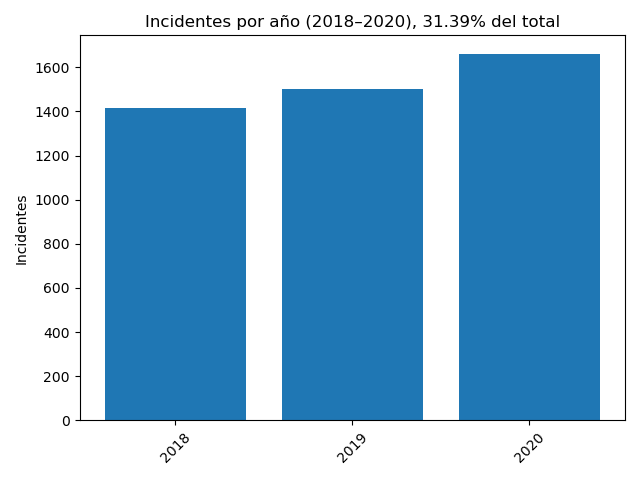
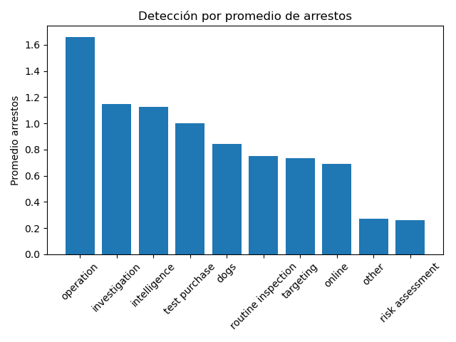
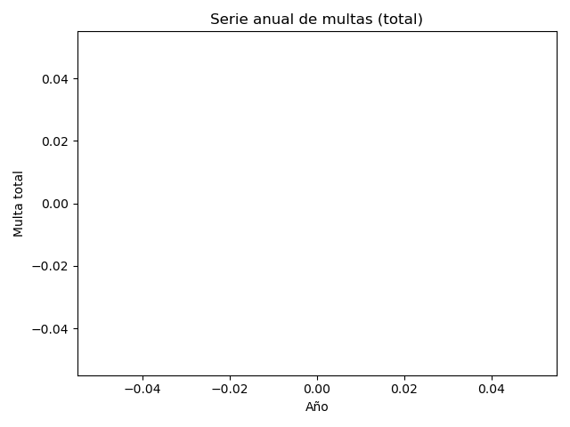
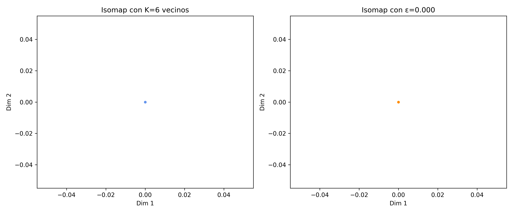

# 🎓 Universidad del Istmo — Facultad de Ingeniería

## **Proyecto Final de Análisis de Datos**

### **Construcción y Visualización de Grafos de Colaboración y Análisis de Incidentes**

### 🧩 Integrantes del equipo

* **Carlos Solares**

---

# 🧩 Parte 1 — Extracción de Datos desde la API de TMDB

## 🎬 Introducción

El objetivo de esta primera fase fue **obtener información real del mundo cinematográfico** desde la base de datos pública **The Movie Database (TMDB)**, utilizando su **API REST**.
Con estos datos, se construyó un **grafo de colaboración entre actores**, que más adelante sería visualizado y analizado.

El enfoque fue diseñado para **automatizar completamente** la extracción y limpieza de los datos, evitando la intervención manual.
El resultado es un conjunto de datos confiables que representan **qué actores han trabajado juntos** y **en qué películas**.

---

## ⚙️ Arquitectura General del Flujo

1. **Definición del actor principal y rango de años.**
   Se selecciona un actor base (por defecto, **Keanu Reeves**) y un rango de años de análisis (1985–2023).

2. **Consulta de filmografía.**
   Se usa el endpoint `/person/{id}/movie_credits` de TMDB para obtener todas las películas en las que ha participado el actor dentro del rango definido.

3. **Obtención de elencos.**
   Por cada película encontrada, se consulta su elenco usando `/movie/{id}/credits`.

---

4. **Procesamiento paralelo.**
   Para mejorar la velocidad, las consultas se ejecutan en **múltiples hilos** (threads), controlados con un **semáforo** que limita las llamadas simultáneas a la API.

5. **Construcción del grafo.**
   Con los datos obtenidos, se van creando **nodos (actores)** y **aristas (colaboraciones)**.

6. **Exportación de resultados.**
   Los resultados se guardan en un archivo `.dot`, que luego puede convertirse en un grafo visual (SVG o PNG).

---

## 🧠 Lógica del Proceso

### 1. Inicialización

El programa define el actor principal y el rango de años a analizar:

```cpp
int mainActorId = 6384; // Keanu Reeves
int startYear = 1985, endYear = 2023;
```

Esto permite concentrar la búsqueda solo en el periodo relevante, evitando exceso de datos.

---

### 2. Obtención de la filmografía

Se utiliza una función auxiliar en `TMDBAPIUtils.cpp`:

```cpp
std::vector<MovieData> filmography = TMDBAPIUtils::getMoviesForActor(mainActorId, startYear, endYear);
```

🔍 **Qué hace internamente:**

* Construye la URL `https://api.themoviedb.org/3/person/{id}/movie_credits?api_key=...`
* Realiza una petición HTTP GET usando la librería **cpr**.
* Parsea la respuesta JSON con **nlohmann/json**.
* Filtra las películas por año de lanzamiento.
* Devuelve un vector con información estructurada:
  *(ID, título, año, fecha de estreno)*

---

### 3. Extracción del elenco por película

Cada película del paso anterior se procesa en paralelo:

```cpp
std::vector<ActorData> cast = TMDBAPIUtils::getMovieCast(movieId);
```

🔍 **Qué hace internamente:**

* Llama al endpoint `/movie/{id}/credits`.
* Obtiene la lista de actores con sus nombres e IDs.
* Limita el número de resultados para evitar ruido.
* Excluye actores repetidos o no relevantes.

---

### 4. Paralelismo y control de concurrencia

Cada consulta a la API se ejecuta en un hilo separado.
Para evitar sobrecargar la API, se usa un **semáforo** que restringe el número de llamadas simultáneas:

```cpp
const int MAX_CONCURRENT_CALLS = 5;
std::counting_semaphore<MAX_CONCURRENT_CALLS> apiSemaphore(MAX_CONCURRENT_CALLS);
```

💡 Este mecanismo garantiza eficiencia sin violar las políticas de uso de la API.

Además, se usa un **mutex** para proteger la estructura del grafo:

```cpp
std::lock_guard<std::mutex> lock(graphMutex);
```

Esto evita que varios hilos modifiquen el grafo al mismo tiempo.

---

### 5. Construcción del grafo de colaboración

Cada vez que se obtiene un elenco, se agregan los actores y las colaboraciones entre ellos:

```cpp
graph.addActor(actor.id, actor.name);
graph.addCollaboration(actor1.id, actor2.id, movieTitle, movieYear);
```

🔗 **Regla clave:**
Solo se guarda **la película más reciente** donde dos actores colaboraron, lo cual evita duplicados y prioriza relevancia actual.

---

### 6. Exportación y visualización

Al finalizar la extracción, se exporta el grafo a formato DOT:

```cpp
graph.exportToDot("colaboraciones.dot");
system("dot -Tsvg colaboraciones.dot -o grafo.svg");
```

Esto genera dos archivos:

* **`colaboraciones.dot`** → formato de texto para Graphviz.
* **`grafo.svg`** → visualización final del grafo.

---

## 🧩 Ejemplo de Resultado (simplificado)

```Ejemplo
Keanu Reeves
 ├── Sandra Bullock  — Speed (1994)
 ├── Laurence Fishburne — The Matrix (1999)
 ├── Carrie-Anne Moss — The Matrix (1999)
 └── Ian McShane — John Wick (2014)
```

Cada línea representa una **colaboración entre actores**, y cada conexión está etiquetada con la película más reciente donde trabajaron juntos.

---

## 💬 Conclusión

En esta primera etapa se logró:

* Automatizar la **extracción de datos reales** desde la API de TMDB.
* Implementar un flujo **eficiente y concurrente** en C++20.
* Crear una **base estructurada de relaciones** actor–actor.
* Preparar los datos para su **almacenamiento, análisis y visualización posterior**.

El resultado es un dataset sólido, listo para ser procesado en la siguiente fase de la presentación: **almacenamiento y visualización**.

¡vamos! Aquí tienes la **Parte 2** en **Markdown**: cómo usamos **base de datos + visualización** para transformar los datos crudos en hallazgos claros y presentables.

---

# 📊 Parte 2 — Base de Datos y Visualización

## 🎯 Objetivo

Tomar los CSV originales (incidents, details, outcomes), **normalizarlos y cargarlos** en una **base SQLite**, y a partir de ahí **generar visualizaciones reproducibles** que respondan preguntas de negocio específicas.

---

## 🧱 Arquitectura técnica (resumen)

* **Motor de BD:** SQLite (ligero, portable, cero-deps de servidor).
* **Carga de datos:** C++ (multi-hilo) con transacciones y *bulk inserts*.
* **Consultas:** SQL con limpieza/normalización “on the fly”.
* **Gráficas:** *matplotlib* desde C++ vía un *wrapper* (`third_party/matplotlibcpp.h`).
* **Contenedores:** Docker + Docker Compose para reproducibilidad (sin instalar dependencias locales).

```
CSV → (DbLoader) → SQLite → (Analytics SQL) → ResultSets → (Chart) → PNG
```

---

## 🐳 Ejecución reproducible con Docker

**docker-compose.yml** (fragmento):

```yaml
services:
  analytics:
    build:
      context: .
      dockerfile: docker/Dockerfile
    image: incidents-analytics:latest
    container_name: incidents-analytics
    volumes:
      - ./data:/app/data:ro
      - ./outputs:/app/outputs/images
```

* Montamos `./data` como **solo lectura** (garantiza integridad de insumos).
* Exportamos **PNG** a `./outputs` para consumo inmediato en la presentación.

---

**Comando único**:

```bash
docker compose up --build --force-recreate
```

> Resultado: se crea/actualiza la BD SQLite, se ejecutan las consultas y se generan las figuras en `outputs/`.

---

## 🗄️ Ingesta y modelo de datos

### Esquema mínimo (SQLite)

* **incidents** (`report_id` PK, `category`, `date`)
* **details** (`report_id`, `subject`, `transport_mode`, `detection`)
* **outcomes** (`report_id`, `outcome`, `num_ppl_fined`, `fine`, `num_ppl_arrested`, `prison_time`, `prison_time_unit`)

Indices por `report_id` para *joins* rápidos.

---

### Carga robusta (C++)

* **Transacciones** por archivo (`BEGIN…COMMIT`) para *bulk insert*.
* **Detección de tipos**: enteros, reales, o texto limpio (se remueven `\r\n\t` y *trailing spaces*).
* **CSV parser** tolerante a comillas y comas dentro de campos.
* **Concurrencia segura**: se carga cada tabla en **conexión separada** (evita “transaction within a transaction”), con límite de paralelismo (semáforo).
* **PRAGMA** de performance: `WAL` + `synchronous=NORMAL`.

> Beneficio: **tiempos de carga** bajos y **consistencia** incluso con archivos grandes o con ruido.

---

## 🔎 Consultas analíticas (SQL + limpieza)

La clase `Analytics` aplica **normalización en la consulta**, p. ej.:

* **Fechas:** se eliminan `CR/LF/espacios` y se valida con `GLOB '[YYYY-MM-DD]'` antes de castear el año.
* **Unidades de prisión → días:** conversión a una escala única (años→365, meses→30, semanas→7).
* **Claves textuales:** `LOWER(TRIM(...))` y filtros de frecuencia para evitar categorías espurias.

Esto nos permite **evitar ETLs pesados**, manteniendo la lógica de limpieza **cerca de las preguntas**.

---

## 🖼️ Visualización programática

`Chart` usa un *wrapper* mínimo a *matplotlib*:

* **Backend sin GUI** (`Agg`) → funciona en Docker *headless*.
* **Gráficas determinísticas** (misma salida entre máquinas).
* **Formato**: PNG de alta calidad listo para informes.

---

### 📌 Resultados y lectura ejecutiva

### (a) Incidentes por año (2018–2020)

<p align="center">
  
</p>

**Qué muestra:** Conteo anual y **% respecto al total histórico** (título).
**Lectura:** Crecimiento 2018→2020; el período representa **≈31.4%** del total de incidentes registrados.

---

### (b) Top 3 de modo de transporte (detección = *intelligence*)

<p align="center">
  
</p>

**Qué muestra:** Entre incidentes detectados por **inteligencia**, ¿qué *transport_mode* domina?
**Lectura:** **Terrestre/vehículo** concentra por mucho el mayor volumen; **mar** y **aire** quedan rezagados.

---

### (c) Métodos de detección por **promedio** de arrestos

<p align="center">
  
</p>

**Qué muestra:** Ordena los métodos de detección por **efectividad operativa** (promedio de arrestos por caso).
**Lectura:** **operation** e **investigation** lideran; **online** y **other** rinden menos.

---

### (d) Categorías con **mayores sentencias** (en días)

<p align="center">
  
</p>

**Qué muestra:** Promedio de días de prisión por **categoría** del incidente (normalizando años/meses/semanas a días).
**Lectura:** **Smuggling/Illegal Trade** y **Poaching/Illegal Harvesting** reciben las penas más severas.

---

### (e) Serie anual de **multas totales**

<p align="center">
  
</p>

**Qué muestra:** Evolución de las multas agregadas por año.
**Lectura:** Ciclos notorios con picos y caídas; posible **efecto pandemia** alrededor de 2020 y reajustes posteriores.

---

## ✅ Validaciones y diagnóstico

Modo opcional `--diagnostico`:

* Conteos por tabla, rango de años, *top-5* de categorías/claves, sumas de multas y arrestos.
* Útil para **sanidad de datos** y **re-ejecuciones rápidas**.

```bash
docker compose run --rm analytics --diagnostico
```

---

## 📦 Decisiones de diseño (por qué así)

* **SQLite**: portabilidad y cero fricción en despliegue/nota académica.
* **Limpieza en SQL**: menos pasos ETL; consultas auto-contenidas y auditables.
* **C++ con paralelismo controlado**: carga rápida sin violar bloqueos; *timeouts* y conexiones separadas evitan condiciones de carrera.
* **Docker**: entornos equivalentes para profesor, estudiante y cualquiera que quiera probarlo.

---

## 🧠 Conclusión de la Parte 2

* Transformamos CSV ruidosos en una **BD confiable** con un **pipeline reproducible**.
* Las consultas responden **preguntas accionables** (tendencias, efectividad operativa, severidad penal).
* Las **gráficas** están listas para incluirse en reportes ejecutivos y toman **segundos** en regenerarse.

> Siguiente paso (Parte 3): **reducción de dimensionalidad** para descubrir patrones latentes no obvios con variables múltiples (ej. PCA / Isomap) y enriquecer la toma de decisiones.

---

# 🧠 Parte 3 — Reducción de Dimensionalidad con ISOMAP

## 🎯 Objetivo

Reducir un conjunto de **7129 variables génicas** a **dos dimensiones** de manera que se conserven las **relaciones geométricas reales** entre muestras biológicas (pacientes con leucemia).
El propósito es **visualizar patrones ocultos** que no son evidentes en el espacio original de alta dimensión.

---

## 🧬 Contexto del Dataset

* **Tipo de datos:** Expresión génica (niveles de activación de genes)
* **Formato:** `.gct` (Gene Cluster Text), estándar en bioinformática.
* **Clases biológicas:**

  * **ALL** — *Leucemia Linfoblástica Aguda* (48 muestras)
  * **AML** — *Leucemia Mieloide Aguda* (25 muestras)

> En total, 73 pacientes y más de 7000 variables por muestra.

---

## 🧩 Algoritmo: ISOMAP (Tenenbaum et al., 2000)

El **ISOMAP (Isometric Mapping)** combina tres conceptos:

1. **Vecindad local (KNN o ε):**
   Conecta cada punto con sus vecinos más próximos para formar un grafo.
2. **Distancias geodésicas:**
   Calcula la distancia mínima sobre el grafo (no la euclidiana directa).
3. **MDS (Multidimensional Scaling):**
   Proyecta los puntos a un espacio de baja dimensión preservando las distancias geodésicas.

> A diferencia del PCA (que asume linealidad), ISOMAP conserva **estructuras no lineales** del manifold subyacente.

---

## ⚙️ Flujo de procesamiento

1. **Lectura y unión de archivos `.gct`**
   Se cargan `all_aml_train.gct` y `all_aml_test.gct` y se combinan en un único `DataFrame`.

2. **Limpieza de datos**
   Se eliminan columnas con valores faltantes (`NaN`) para asegurar coherencia en las métricas de distancia.

3. **Estimación de vecindad:**

   * **KNN:** 6 vecinos por muestra.
   * **ε (epsilon):** valor adaptativo calculado automáticamente desde las distancias al séptimo vecino.

---

## ⚙️ Flujo de procesamiento

4. **Construcción del grafo de conectividad**

   * Si se usa KNN → se conecta cada muestra con sus 6 vecinos más cercanos.
   * Si se usa ε → se conecta cada muestra con todas las que estén dentro del radio ε.

5. **Cálculo de distancias geodésicas**
   Con `scipy.sparse.csgraph.shortest_path`, obteniendo la matriz completa de distancias entre pares.

---

## ⚙️ Flujo de procesamiento

6. **Embedding en 2D (MDS clásico)**
   A partir de la matriz de distancias, se calculan los **autovectores** de la matriz doblemente centrada `B = -0.5 * J D² J`.

7. **Visualización**
   Se grafican las dos primeras componentes (mayores autovalores) para obtener el plano bidimensional.

---

## 🧪 Ejecución y salidas

**Comando:**

```bash
python analyze_isomap.py
```

**Resultados generados:**

* `output/isomap_knn.csv` — Embedding con K=6 vecinos
* `output/isomap_eps.csv` — Embedding con ε-vecindad
* `output/isomap_comparison.png` — Comparación visual de ambos métodos

---

## 📊 Resultados visuales

### Comparación entre métodos

<p align="center">
  
</p>

**Izquierda:** ISOMAP con **K=6 vecinos**
**Derecha:** ISOMAP con **ε = 107557.388**

---

### 🔵 Gráfica izquierda — *K = 6 vecinos*

* **Representación:** Grafo de conectividad con los 6 vecinos más próximos.
* **Observación:**

  * Clara separación entre los grupos **ALL (azul)** y **AML (rojo)**.
  * Los puntos de cada clase se agrupan de forma coherente.
* **Interpretación:**

  * El eje X captura la **mayor varianza genética** entre tipos celulares.
  * El eje Y representa **variaciones secundarias** dentro de cada grupo.
  * Alta cohesión: las relaciones locales se preservan correctamente.

---

### 🔴 Gráfica derecha — *ε = 107557.388*

* **Representación:** Grafo de conectividad por radio (ε).
* **Observación:**

  * Conexiones excesivas → los grupos se mezclan parcialmente.
  * Pérdida de cohesión y menor separación de clases.
* **Interpretación:**

  * El valor de ε fue demasiado grande, conectando puntos distantes.
  * Esto degrada la estructura geodésica y reduce la interpretabilidad del espacio.

---

## 📈 Comparación técnica

| Aspecto                   | ISOMAP (K=6 vecinos) ✅ | ISOMAP (ε=107557.388) ⚠️   |
| ------------------------- | ---------------------- | -------------------------- |
| Separación ALL vs AML     | Clara                  | Parcial / dispersa         |
| Cohesión dentro de clases | Alta                   | Baja / irregular           |
| Conectividad del grafo    | Local y robusta        | Global pero ruidosa        |
| Preservación geodésica    | Buena                  | Afectada por sobreconexión |
| Interpretabilidad         | Alta                   | Media                      |

---

## 🧠 Conclusiones finales

* El método **KNN con K=6** produce un **embedding más interpretable y estable**.
* El método basado en ε requiere una calibración más precisa:
  un valor muy grande conecta muestras disímiles, y uno muy pequeño puede fragmentar el grafo.
* En contextos de datos biomédicos de alta dimensión:

  * ISOMAP **ayuda a identificar patrones genéticos latentes**.
  * Es útil para **diagnóstico asistido** o exploración de subtipos de pacientes.
  * Puede integrarse con **PCA o t-SNE** como técnicas complementarias.